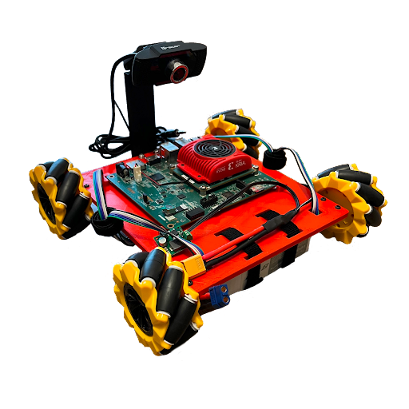
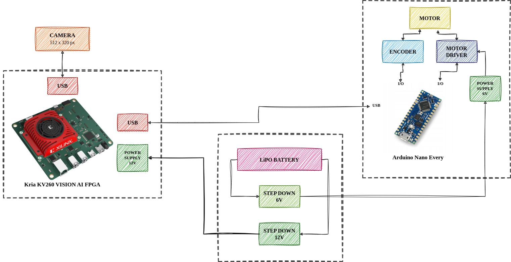

**Xilinx Open Hardware 2023**, **Team number: xohw23-168**

# **Detection-segmentation solution for controlling an autonomous vehicle in traffic on a city model on a Kria KV260 platform**



Link to YouTube Video: [URL](https://www.youtube.com/watch?v=3J6ZI1N3YoA)

*University name:* AGH University of Krakow, Poland

*Participants:* 
* Mateusz Wąsala, e-mail: wasala@agh.edu.pl
* Maciej Baczmański, e-mail: mbaczmanski@student.agh.edu.pl
* Robert Synoczek, e-mail: synoczek@student.agh.edu.pl
* Kamil Ptak, e-mail: kamilptak@student.agh.edu.pl

*Supervisor:* Tomasz Kryjak, e-mail: tomasz.kryjak@agh.edu.pl

 
# Technicals



## Hardware
* Board: **Kria KV260 Vision AI Starter Kit**
* Camera:  **USB Camera**
* Motor controller board: **Arduino Nano Every**

## Software
* [Ubuntu Desktop 22.04 LTS](https://ubuntu.com/download/amd-xilinx)
* [PYNQ For Kria SOMs v3.0](https://github.com/Xilinx/Kria-PYNQ)


# Brief description

Perception and control systems for autonomous vehicles are currently an active area of scientific and industrial research. These solutions aim to show significant performance in recognising obstacles and environmental elements in different road conditions, while maintaining real-time capability and energy efficiency. To achieve such functionality, an appropriate algorithm and a well-suited computing platform are required. In this project, we have utilised the MultiTaskV3 detection-segmentation network as the fundamental basis for a perception system that can seamlessly perform both functionalities within a unified architecture. The network was suitably trained, quantised and implemented on the AMD Xilinx Kria KV260 Vision AI embedded platform. With this device, it was possible to parallelize and accelerate computational processes. Additionally, the entire system consumes remarkably low power in comparison to CPU-based implementations, with an average of 5 watts as opposed to a minimum of 55 watts for weaker CPUs. Moreover,the platform's compact dimensions ($119 \times 140 \times 36$ mm) allow it to be used in devices with limited available space. The system achieves an accuracy exceeding 97% in mean Average Precision (mAP) for object detection and exceeds 90% in mean Intersection over Union (mIoU) score for image segmentation. Furthermore, this project enables the real time control of an Arduino-based robot by transmitting desired speed values ($V_x$, $V_y$, and $\omega$) through the USB serial protocol, and getting data from a connected USB camera.


:green_book: Publications:
* [Detection-segmentation convolutional neural network for autonomous vehicle perception](readme_files/Detection_segmentation_convolutional_neural_network_for_autonomous_vehicle_perception.pdf) (accepted for MMAR 2023 conference)
* [Implementation of a perception system for autonomous vehicles using a detection-segmentation network in SoC FPGA](readme_files/Implementation_of_a_perception_system_for_autonomous_vehicles_using_a_detection_segmentation_network_in_SoC_FPGA.pdf) (accepted for ARC 2023 conference)

# Repository content

```
├── LICENSE
├── mt_kria <git submodule>
├── MTV3_KV260
│   ├── demo
│   │   ├── img1.jpg
│   │   ├── img2.png
│   │   ├── img3.png
│   │   ├── img4.png
│   │   ├── img5.png
│   │   ├── img6.png
│   │   ├── img7.png
│   │   ├── img8.jpg
│   │   └── img9.jpg
│   ├── files
│   │   ├── cityscapes19.png
│   │   ├── MTV3.xmodel
│   │   └── priors.pckl
│   ├── lib
│   │   ├── box_utils.py
│   │   ├── detection.py
│   │   └── LICENSE.txt
│   └── multitask.ipynb
└── README.md
```

# Instructions to test project

Files needed to run the code are located in `MTV3_KV260` directory.
Project can be run in demo or full mode.
We have provided some sample images for demo mode.
If you wish to run the code in full mode, you need to attach an USB Camera and USB serial device which can receive $V_x$, $V_y$ and $\omega$ vector values and control the robot basing on them.


## Board setup:

* Prepare the Kria board, following [PYNQ For Kria SOMs v3.0](https://github.com/Xilinx/Kria-PYNQ) instructions.
* Copy files located in `MTV3_KV260` to Jupyter Directory.
* Run the `multitask.ipynb` on Kria.
By default program will be run in demo mode.

## Switching between full and demo modes:

Modes can be switched by changing `DEMO` value (`True` for demo mode, `False` for full mode).
If you wish to use full mode and activate debug (to show captured frames and algorithm's output),
change `debug` from `False` to `True` in line:

```python
main(img,dev,debug = False)
```

---
**NOTE:**

If you wish to run the full mode, change device path in line:
```python
dev = serial.Serial(
    '/dev/serial/by-id/usb-Arduino_LLC_Arduino_Nano_Every_85B4DF415153543553202020FF190F4E-if00',
    115200,
    timeout=0.050)
```
To find path to your device, you can open terminal on Jupyter server and type:
```
ls /dev/serial/by-id
```
---

## Training your own model (optional):

You can train the model using tools available in our other [repository](https://github.com/vision-agh/mt_kria).
Repository is also attached as a submodule to this repo.
To initialize it, use below command:
```
git submodule update --init
```
`Readme.md` provides information about system setup, dataset structure.
It also contains instructions on how to train and evaluate your model.

After training the network, quantize and deploy the model using `run_quant.sh` and `run_deploy.sh` scripts provided in repository.

To compile deployed model we recommend using tools provided by Vitis-AI 2.5: [Github Repository](https://github.com/Xilinx/Vitis-AI/tree/v2.5).
Instructions on compiling using Vitis AI compilers are available [here](https://docs.xilinx.com/r/2.5-English/ug1414-vitis-ai/Compiling-the-Model?tocId=pk2CRNNuSPB2B~TZHyOGgQ).
